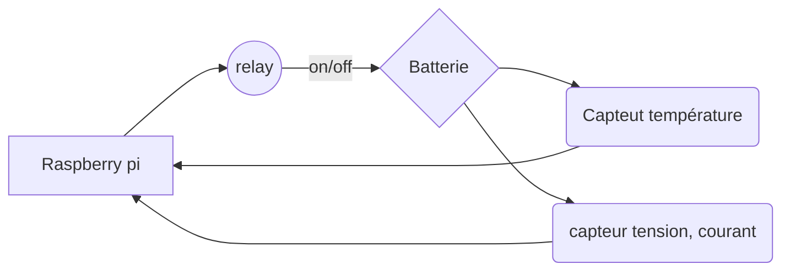

# Projet contrôleur de charge d'une batterie
## Guillaume et Christophe

-	Le projet a pour but de contrôler la charge d'une batterie.
-	Si la batterie est pleine nous coupons la charge avec un relaie connecté au chargeur de la batterie.
-	Si la batterie est en dessous d'une certaine tension nous envoyons un message à l'utilisateur pour lui indiquer que la batterie est défectueuse.
-	Si la température dépasse les 80 degrés une commande est envoyé pour couper la charge et un email est envoyer à l'utilisateur. Si la température dépasse les 100 degré un email est envoyé toute les minutes.

### Lancer le projet :
`docker compose build && docker compose up -d`

### Url du projet:
`http://"votre ip"/flask`

###Chéma du projet:
