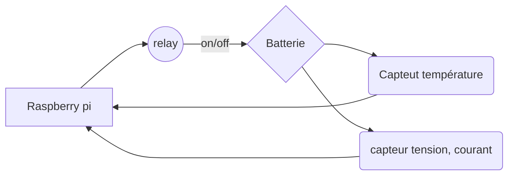
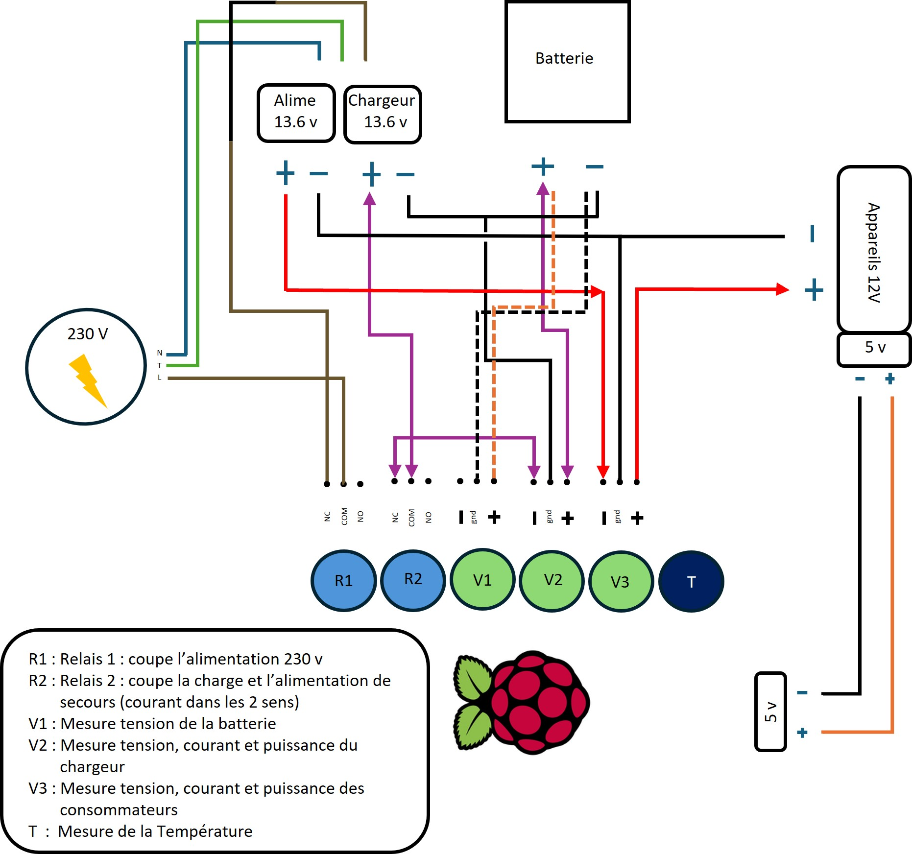
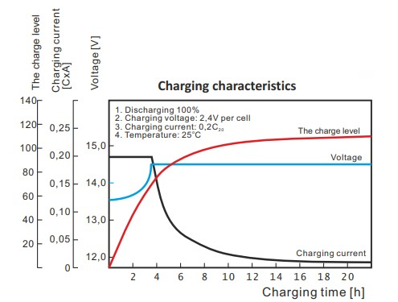

# Projet contrôleur de charge d'une batterie
## Guillaume et Christophe

# Concept du projet 

## Introduction

Dans le cadre d'une application réelle, des batteries sont utilisées comme alimentations de secours pour des appareils connectés en permanence au réseau 230 V. 
Toutes les batteries utilisées se sont révélées hors d'usage après une durée de vie d'environ 15 mois, alors que leur durée de vie annoncée est de 5-8 ans. 
Notre projet a pour objectif de permettre la récolte de mesures sur l'activité de la batterie, de l'alimentation 230 V et du chargeur ainsi que de pouvoir effectuer des simulations de fonctionnement.


## Hardware

Un Raspberry Pi 5 - 16 Gb de RAM été choisi comme contrôleur. Plusieurs accessoires ont été ajoutés :
- Module avec 4 relais 230 V ==> *PiRelay v2 Shield*
- Module I2C avec 4 entrées permettant la mesure de tension, de courant et de puissance, de 0 à 26 V ==> *4-ch Current/Voltage/Power Monitor HAT for Raspberry Pi, I2C/SMBus*
- *Module I2C permettant la mesure de température (pas encore implémenté)*

## Installation *(voir schéma ci-dessous)*

### Les relais : 

- **R1** : connecté NO sur l'**alimentation électrique principale 230V**, ce qui permet de couper à distance le raccordement électrique de toute l'installation, ainsi de forcer le fonctionnement sur l'alimentation de secours.

- **R2** : connecté NO sur le **circuit de charge** ce qui permet d'interrompre la charge de la batterie. Dans notre cas, il interrompt également le secours énergétique de la batterie *(déconnecte complètement la batterie)*.

### Le module I2C de mesures
*(il faut noter que cet équipement nécessite une consommation de courant pour pouvoir effectuer les mesures)*

- **V1** : connecté à la **batterie**, avec une résistence de 10 kOhm. Permet de mesurer la tension de la batterie.

- **V2** : connecté au **circuit de charge**, afin de pouvoir récupérer les valeurs envoyées du chargeur vers la batterie
- **V3** : connecté au circuit d'**alimentation des équipements** afin de  utilisés par les consommateurs. 

## Software (succinct)

Tout l'environnement a été déployé sur la base de dockers. 

Une instance **Nginx** fonctionne comme reverse proxy et route le trafic sur un **framework Flask**.

Ce framework est le tiers 1/3 du système, soit le coeur d'affichage et de contrôle pour l'utilisateur. Il permet d'envoyer des ordres au script, de questionner la DB et d'afficher des graphiques.

Un **script Python** a été élaboré pour interragir avec les équipements hardware et contient la logique des processus et se positionne donc dans le tiers 2/3. Les modes de fonctionnement et variantes seront appliqués, selon des ordres provenant de l'utilisateur, via le framework Flask. 

Un **serveur Promotheus** a été déployé pour recevoir toutes les mesures horodatées.

Finalement une instance **Grafana** est utilisée pour permettre la conception de tableaux de bords et de graphiques, lesquels permettront de visualiser, via le framework Flask, les différentes mesures, selon les modes utilisés. 

Ces deux dernières instances constituent le tiers 3/3, soit la partie de stockage des valeurs.

## Modes de fonctionnement 

*note : \
relais ouvert = circuit électrique coupé* \
*relais fermé = circuit électrique connecté*

Rpi5 = Raspberry Pi 5 et accessoires

### **Observateur** (fonctionnement par défaut)

Le système se limite à effectuer des mesures lors du fonctionnement normal des objets. 

Le Rpi5 : 
- ferme le relais 1 et le relais 2
- récolte 10 mesures de tension, de courant, de puissance 
- une moyenne de ces valeurs est faite (pour limiter le risque d'erreur de mesure) et la transmet au serveur Prometheus

### **Protection contre la surcharge**

Le système mesure la tension de la batterie et lorsqu'elle atteint la tension de 12.9 V, ouvre le relais pour interrompre la charge.

Le Rpi5 :
- ferme le relais 1 et le relais 2
- récolte 10 mesures de tension, de courant, de puissance. 
- effectue une moyenne de ces valeurs et la transmet au serveur Prometheus

Lorsque la valeur moyenne des mesures dépasse 12.9 V 

- ouvre le relais 2 pour interrompre le circuit de charge.
- récolte 10 mesures de tension, de courant, de puissance et de température. 
- effectue une moyenne de ces valeurs et la transmet au serveur Prometheus

Lorsque la valeur moyenne des mesures est en dessous de 12.7 V 

- ferme le relais 2 pour relancer la charge et reprend le processus de départ.

### **Cycle de consommation**

Le système coupe l'alimentation électrique principale forçant les équipements à se servir de l'alimentation de secours. La batterie est donc forcée d'effectuer un cycle partiel. Une fois déchargée à la tension voulue, le système reconnecte l'alimentation 230 V et recharge la batterie. Une fois la batterie atteignant la tension souhaitée, la charge sera interrompue par le relais.

Le Rpi5 :
- ouvre le relais 1 et le relais 2
- récolte 10 mesures de tension, de courant, de puissance. 
- effectue une moyenne de ces valeurs et la transmet au serveur Prometheus

Lorsque la valeur moyenne des mesures est en dessous de  12.4 V 

- ferme le relais 1 et le relais 2 pour lancer la charge.
- récolte 10 mesures de tension, de courant, de puissance. 
- effectue une moyenne de ces valeurs et la transmet au serveur Prometheus

Lorsque la valeur moyenne des mesures dépasse 12.9 V 

- ouvre le relais 2 pour stopper la charge 
- récolte 10 mesures de tension, de courant, de puissance. 
- effectue une moyenne de ces valeurs et la transmet au serveur Prometheus

Si la tension de la batterie descend en dessous de 12.4 V

- ferme le relais 2 pour reprendre la charge

## Alarming et monitoring  
*Ce poste n'a pas encore été implémenté*

### Dispositif de sécurité

Si la température dépasse une certaine valeur, un message d'alerte est transmis à l'utilisateur. Soit par le biais d'un popup dans le framework Flask, soit par e-mail si un serveur SMTP est disponible.

Si la température dépasse une valeur limite, le système ouvre le relais 2 pour stopper la charge. Le message d'erreur sont également transmis. 


### Schémas






### Valeurs attendues de la charge des batteries




### Structure du projet générale

```
└── regulateur_tension
    ├── .gitignore
    ├── cara_charge.jpg
    ├── docker-compose.yml
    ├── README.md
    ├── schema.jpg
    ├── script
    │   ├── .dockerignore
    │   ├── data.py
    │   ├── dockerfile.script
    │   ├── main.py
    │   ├── requirements.txt
    │   ├── transmitting.py
    │   ├── raspberry
    │   │   ├── infoPc.py
    │   │   ├── lineGpio.py
    │   │   ├── multimetre.py
    │   │   ├── relay.py
    │   │   └── __init__.py
    │   ├── modes
    │   │   ├── consomation.py
    │   │   ├── manuel.py
    │   │   ├── observer.py
    │   │   ├── protect.py
    │   │   └── __init__.py
    │   └── dataBase
    │       ├── prometheus.py
    │       ├── sensor.py
    │       └── __init__.py
    ├── prometheus
    │   └── prometheus.yml
    ├── nginx
    │   ├── default.conf
    │   ├── dockerfile.rev_proxy
    │   └── nginx.conf
    ├── grafana
    │   ├── grafana.ini
    │   ├── dashboards
    │   │   └── Raspberry_pi.json
    │   ├── data
    │   │   └── grafana.db
    │   └── provisioning
    │       ├── dashboards
    │       │   └── dashboards.yaml
    │       └── datasources
    │           └── datasource.yaml
    └── flask
        ├── dockerfile.flask
        ├── main.py
        ├── requirements.txt
        ├── templates
        │   ├── about.html
        │   ├── grafana.html
        │   ├── index.html
        │   ├── multimeter.html
        │   ├── prometheus.html
        │   └── relay.html
        └── static
            ├── bootstrap_min.css
            ├── Crimson_Pro.css
            ├── gauge.js
            ├── jquery.min.js
            ├── menu.css
            ├── script_about.js
            ├── script_home.js
            ├── script_multimeter.js
            ├── script_relay.js
            ├── socket.io.min.js
            └── style.css
```
### Structure de l'onglet flask (server)
```
└── flask
    ├── dockerfile.flask
    ├── main.py
    ├── requirements.txt
    ├── templates
    │   ├── about.html
    │   ├── grafana.html
    │   ├── index.html
    │   ├── multimeter.html
    │   ├── prometheus.html
    │   └── relay.html
    └── static
        ├── bootstrap_min.css
        ├── Crimson_Pro.css
        ├── gauge.js
        ├── jquery.min.js
        ├── menu.css
        ├── script_about.js
        ├── script_home.js
        ├── script_multimeter.js
        ├── script_relay.js
        ├── socket.io.min.js
        └── style.css
```

### Structure l'onglet script

```
└── script
    ├── .dockerignore
    ├── data.py
    ├── dockerfile.script
    ├── main.py
    ├── requirements.txt
    ├── transmitting.py
    ├── raspberry
    │   ├── infoPc.py
    │   ├── lineGpio.py
    │   ├── multimetre.py
    │   ├── relay.py
    │   └── __init__.py
    ├── modes
    │   ├── consomation.py
    │   ├── manuel.py
    │   ├── observer.py
    │   ├── protect.py
    │   └── __init__.py
    └── dataBase
        ├── prometheus.py
        ├── sensor.py
        └── __init__.py
```
### Informations complémentaires
- **data.py** ==> variable de classe
- **main.py** ==> script principal du projet. 
                    a) Récupère les valeurs du multimètre. 
                    b) Logique du contrôleur. 
                    c) Envoie les valeurs à la base de donnée.
- **transmitting.py**(Hérite de data.py) ==> Connection socket avec le server flask.

- **dossier raspberry** : c'est fichier non pas de dépendance avec data.py, pour les garder modulaire pour d'autre projet:
    - **infoPc.py** ==> retrourne les infos du pc
    - **lineGpio.py** ==> pour intèragir avec les gpio de la Raspberry
    - **multimetre.py** ==> retourn en I2C les valeurs du module multimètre
    - **relay.py** ==> active ou désactive un relais (relais = objet lineGpio.py )

- **dossier modes** :
    - **observer.py** *(hérite de data.py)* ==> Mode de fonctionnement par défaut de l'installation. Il se contente de collecter des informations
    - **consomation.py** *(hérite de data.py)* ==> Mode de fonctionnement qui va simuler une coupure d'alimentation électrique, afin de forcer la batterie à effectuer des cycles.
    - **manuel.py** *(hérite de data.py)* ==> Mode qui permet à l'utilisateur d'interagir avec les relais, via la page Web.
        
    - **protect.py** *(hérite de data.py)* ==> Mode de fonctionnement qui va mesurer la tension de la batterie et une fois que la batterie a atteint la tension de charge maximale, le système va couper la charge, jusqu'à ce que la tension passe en dessous de 0.2v de la tension maximale

- **dossier dataBase** :
    - **prometheus.py** ==> 
    - **sensor.py** ==> Créer des capteur pour prometheus, ici nous utiliseront deux sortes de capteurs
        - le capteur **gauge** qui accepte des variable float pour :  
            - les datas du multimètres 
            - les info sur la Raspberry
        - le capteur **enum** qui accepte des varibles string dans notre cas ```(['starting', 'stopped'])```, pour :
            - les états des relais 
            - le mode de fonctionnent du programme


### Liste de variable la raspberry pi 

|  Cpu variable |      ram variable     |    disque variable    |
|---------------|-----------------------|-----------------------|
|"cpu_temp"     |"porcent_ram_ussed"    |"porcent_disk_ussed"   |
|"cpu_usage"    |"ram_free"             |"disk_ussed"           |
|"cpu_volt"     |"ram_ussed"            |"disk_free"            |
|               |"ram_total"            |"disk_total"           |           

### Liste de variable l'état des relais

|  numéro | Relaie  |      
|---------|---------|
|   N°1   | "rs_01" |
|   N°2   | "rs_02" |
|   N°3   | "rs_03" |
|   N°4   | "rs_04" |


### Liste de variable l'état de la batterie

|  numéro |     bus voltage      |      shun tvoltage    |     power     |     current     |      
|---------|----------------------|-----------------------|---------------|-----------------|
|   N°1   |"bus_voltage_01"  |"shunt_voltage_01" |"power_01" |"current_01" |
|   N°2   |"bus_voltage_02"  |"shunt_voltage_02" |"power_02" |"current_02" |
|   N°3   |"bus_voltage_03"  |"shunt_voltage_03" |"power_03" |"current_03" |
|   N°4   |"bus_voltage_04"  |"shunt_voltage_04" |"power_04" |"current_04" |


### Mode de fonctionnement du système

|   mode     |varaible |      
|------------|---------|
| bservateur | "au_ob" |
| Protection | "au_pr" |
|Consommation| "au_co" |
|   Manuel   | "au_ma" |


### Lancer le projet :
`docker compose build && docker compose up -d`

### Url du projet:
`http://"ip du raspberry pi"/flask`