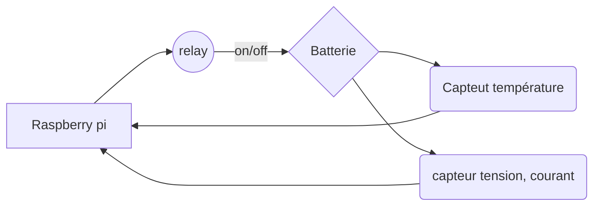

# Projet contrôleur de charge d'une batterie
## Guillaume et Christophe

# Concept du projet 

## Introduction

Dans le cadre d'une application réelle, des batteries sont utilisées comme alimentation de secours pour des appareils connectés en permanence au réseau 230 V. 
Toutes les batteries utilisées se sont révélées hors d'usage après une durée de vie d'environ 15 mois, alors que leur durée de vie annoncée est de 5-8 ans. 
Notre projet à pour objectif de permettre la récolte de mesures sur l'activité de la batterie, de l'alimentation 230 V et du chargeur ainsi que de pouvoir effectuer des simulations de fonctionnement.

## Hardware

Un Raspberry Pi 5 - 16 Gb de RAM été choisi comme contrôleur. Plusieurs accessoires ont été ajoutés :
- Module avec 4 relais 230 V
- Module I2C avec 4 entrées permettant la mesure de tension de 0 à 26 V
- Module I2C permettant la mesure de température

## Installation

- L'alimentation électrique principale est connectée au relais no 1, ce qui permet de couper à distance le raccordement électrique de toute l'installation, ainsi de forcer le fonctionnement sur l'alimentation de secours.

- Le circuit de charge est connectée au relais no 2, ce qui permet d'interrompre la charge de la batterie.

- La batterie est raccordée à l'entrée numéro 1 du moniteur de tension, afin que des mesures de tensions puissent être effectuées de façon récurentes.

- Le circuit de charge est raccordé en série sur l'entrée numéro 2 du moniteur de tension, afin de pouvoir récupérer la tension, la puissance ainsi que le courant envoyé par le chargeur sur la batterie
- Le circuit d'alimentation des équipements est raccordé sur l'entrée numéro 3 du moniteur de tension, afin de pouvoir récupérer la tension, la puissance ainsi que le courant utilisés par les consommateurs. 

## Software (succinct)

Tout l'environnement a été déployé sur la base de dockers. 

Une instance **Nginx** fonctionne comme reverse proxy et route le trafic sur un **framework Flask**.

Ce framework est le tiers 1/3 du système, soit le coeur d'affichage et de contrôle pour l'utilisateur. Il permet d'envoyer des ordres au script, de questionner la DB et d'afficher des graphiques.

Un **script Python** a été élaboré pour interragir avec les équipements hardware et contient la logique des processus et se positionne donc dans le tiers 2/3. Les modes de fonctionnement et variantes seront appliqués, selon des ordres provenant de l'utilisateur, via le framework Flask. 

Un **serveur Promotheus** a été déployé pour recevoir toutes les mesures horodatées.

Finalement une instance **Grafana** est utilisée pour permettre la conception de tableaux de bords et de graphiques, lesquels permettront de visualiser, via le framework Flask, les différentes mesures, selon les modes utilisés. 

Ces deux dernières instances constituent le tiers 3/3, soit la partie de stockage des valeurs.

## Modes de fonctionnement 

*note : \
relais ouvert = circuit électrique coupé* \
*relais fermé = circuit électrique connecté*

Rpi5 = Raspberry Pi 5 et accessoires

### **Observateur** (fonctionnement par défaut)

Le système se limite à effectuer des mesures lors du fonctionnement normal des objets. 

Le Rpi5 : 
- ferme le relais 1 et le relais 2
- récolte 10 mesures de tension, de courant, de puissance 
- une moyenne de ces valeurs est faite (pour limiter le risque d'erreur de mesure) et la transmet au serveur Prometheus

### **Protection contre la surcharge**

Le système mesure la tension de la batterie et lorsqu'elle atteint la tension de 12.9 V, ouvre le relais pour interrompre la charge.

Le Rpi5 :
- ferme le relais 1 et le relais 2
- récolte 10 mesures de tension, de courant, de puissance. 
- effectue une moyenne de ces valeurs et la transmet au serveur Prometheus

Lorsque la valeur moyenne des mesures dépasse 12.9 V 

- ouvre le relais 2 pour interrompre le circuit de charge.
- récolte 10 mesures de tension, de courant, de puissance et de température. 
- effectue une moyenne de ces valeurs et la transmet au serveur Prometheus

Lorsque la valeur moyenne des mesures est en dessous de 12.7 V 

- ferme le relais 2 pour relancer la charge et reprend le processus de départ.

### **Cycle de consommation**

Le système coupe l'alimentation électrique principale forçant les équipements à se servir de l'alimentation de secours. La batterie est donc forcée d'effectuer un cycle partiel. Une fois déchargée à la tension voulue, le système reconnecte l'alimentation 230 V et recharge la batterie. Une fois la batterie atteignant la tension souhaitée, la charge sera interrompue par le relais.

Le Rpi5 :
- ouvre le relais 1 et le relais 2
- récolte 10 mesures de tension, de courant, de puissance. 
- effectue une moyenne de ces valeurs et la transmet au serveur Prometheus

Lorsque la valeur moyenne des mesures est en dessous de  12.4 V 

- ferme le relais 1 et le relais 2 pour lancer la charge.
- récolte 10 mesures de tension, de courant, de puissance. 
- effectue une moyenne de ces valeurs et la transmet au serveur Prometheus

Lorsque la valeur moyenne des mesures dépasse 12.9 V 

- ouvre le relais 2 pour stopper la charge 
- récolte 10 mesures de tension, de courant, de puissance. 
- effectue une moyenne de ces valeurs et la transmet au serveur Prometheus

Si la tension de la batterie descend en dessous de 12.4 V

- ferme le relais 2 pour reprendre la charge

## Alarming et monitoring  
*Ce poste n'a pas encore été implémenté*

### Dispositif de sécurité

Si la température dépasse une certaine valeur, un message d'alerte est transmis à l'utilisateur. Soit par le biais d'un popup dans le framework Flask, soit par e-mail si un serveur SMTP est disponible.

Si la température dépasse une valeur limite, le système ouvre le relais 2 pour stopper la charge. Le message d'erreur sont également transmis. 

### Lancer le projet :
`docker compose build && docker compose up -d`

### Url du projet:
`http://"votre ip"/flask`

### Schémas

### Liste de variable la raspberry pi 

|  Cpu variable |      ram variable     |    disque variable    |
|---------------|-----------------------|-----------------------|
|"cpu_temp"     |"porcent_ram_ussed"    |"porcent_disk_ussed"   |
|"cpu_usage"    |"ram_free"             |"disk_ussed"           |
|"cpu_volt"     |"ram_ussed"            |"disk_free"            |
|               |"ram_total"            |"disk_total"           |           

### Liste de variable l'état des relais

|  numéro | Relaie  |      
|---------|---------|
|   N°1   | "rs_01" |
|   N°2   | "rs_02" |
|   N°3   | "rs_03" |
|   N°4   | "rs_04" |

### Liste de variable l'état de la batterie

|  numéro |     bus voltage      |      shun tvoltage    |     power     |     current     |      
|---------|----------------------|-----------------------|---------------|-----------------|
|   N°1   |"bat_bus_voltage_01"  |"bat_shunt_voltage_01" |"bat_power_01" |"bat_current_01" |
|   N°2   |"bat_bus_voltage_02"  |"bat_shunt_voltage_02" |"bat_power_02" |"bat_current_02" |
|   N°3   |"bat_bus_voltage_03"  |"bat_shunt_voltage_03" |"bat_power_03" |"bat_current_03" |
|   N°4   |"bat_bus_voltage_04"  |"bat_shunt_voltage_04" |"bat_power_04" |"bat_current_04" |

### Mode de fonctionnement du système
|   mode     |varaible |      
|------------|---------|
| bservateur | "au_ob" |
| Protection | "au_pr" |
|Consommation| "au_co" |
|   Manuel   | "au_ma" |

### Valeurs attendues 

