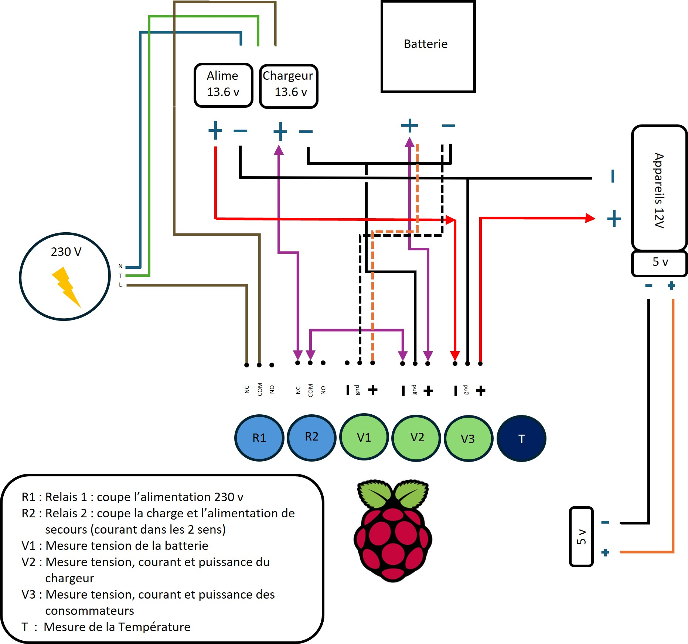

# Projet contrôleur de charge d'une batterie
## Guillaume et Christophe

-	Le projet a pour but de contrôler la charge d'une batterie.
-	Le programme a pour mission d'effectuer des relevés de tension et de définir l'état de charge de la batterie surveillée. 
-   Différentes actions seront entreprises selon le développement du script.
-   Les valeurs sont transmises à un serveur Prometheus
-   une application Grafana permet de consulter la base Prometheus et d'afficher des graphes.
-   Le tout est monitoré et contrôlé par une application web, basée sur le Framework Flask, lequel est exposé à l'extérieur via un reverse proxy Nginx.

## fonctionnalités envisagées 

-   Si la batterie est pleine, nous coupons la charge avec un relais connecté au Raspberry.
-	Si la batterie est en dessous d'une certaine tension, le relais lancera la charge.
-   Les valeurs de tensions, de températures seront récoltées périodiquement et stockées pour analyse.
-   Un server SMTP sera déployé pour permettre l'envoi d'e-mail.

## Système d'alarme :

-   En cas de décharge profonde, un message devrait être envoyé à l'utilisateur par e-mail, ou par le biais d'un popup sur l'interface web, pour lui indiquer que la batterie est défectueuse.
-   Si la température dépasse les 80 degrés, une commande est envoyé au relais pour couper la charge. Un message devrait être envoyé à l'utilisateur par e-amil, ou par le biais d'un popup sur l'interface web, pour lui indiquer qu'il y a un risque de surchauffe. 
-   Si la température dépasse les 100 degrés un email est envoyé toutes les minutes.

### Lancer le projet :
`docker compose build && docker compose up -d`

### Url du projet:
`http://"votre ip"/flask`

### Schémas

